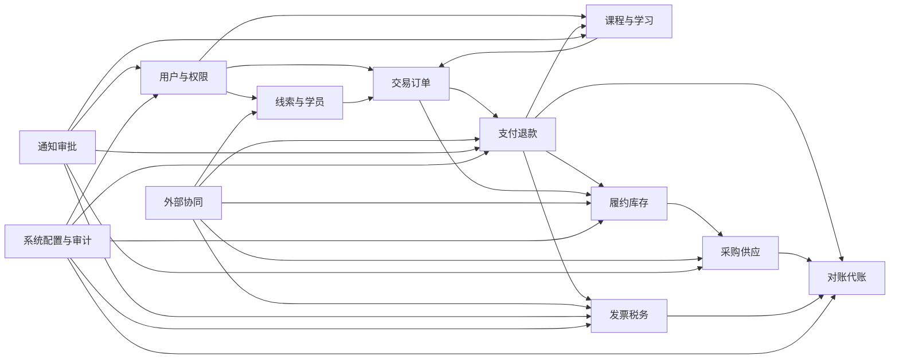

# 03-模块设计文档

## 1. 文档定位

| 项目 | 说明 |
|---|---|
| 文档目标 | 为新系统后续领域模型、数据库、接口、权限和测试设计确定模块骨架、职责边界、依赖关系和协作方式 |
| 上游依据 | `00-文档说明.md`、`01-需求规格说明书.md`、`02-业务流程与状态机说明.md`、`docs/原型设计方案` 下三端原型、`系统设计约束.md`、`交互与联调说明.md` |
| 设计原则 | 按当前原型和新系统业务重新拆模块，不继承历史代码、历史数据库、历史接口、历史架构和历史前端页面 |
| 适用对象 | 后端开发、前端开发、测试验收、接口联调、数据库设计、权限矩阵设计和毕设演示准备人员 |
| 下游影响 | `04-领域模型与数据字典.md`、`05-数据库设计文档.md`、`06-API接口文档.md`、`07-外部系统联调文档.md`、`08-权限矩阵文档.md`、`09-测试与验收用例.md` |

本文件只定义新系统模块边界和协作口径。后续数据库表、接口路径、DTO 字段、枚举编码和权限编码不得从历史失败产物中直接迁移，应以本文件和上游设计文档重新设计。

## 2. 模块拆分原则

| 原则 | 说明 |
|---|---|
| 订单中心化 | 交易订单模块是业务单据链中枢，串联支付记录、学习权益、发货单、退款单、发票单、对账记录和代账材料 |
| 状态归属清晰 | 支付、退款、履约、开票、采购等状态由各自模块负责，订单只保存摘要状态和单据链入口 |
| 端侧入口分离 | PC 管理端、小程序端、企微/外部协同端共享业务能力，但页面入口和权限边界分别设计 |
| 外部适配隔离 | 企业微信、微信支付、物流、电子发票等外部能力通过统一适配契约接入，业务模块不直接依赖平台 SDK 或 Mock 类 |
| 财税口径独立 | 发票、税务、对账、代账模块与交易主链路解耦，财税预测和经营建议仅作经营参考 |
| 通知审批通用化 | 角色申请、课程上下架、采购审批、退款待办、红冲待办等共用通知审批能力，业务模块只提交审批或待办请求 |
| 审计不可绕过 | 角色分配、退款、发货、采购、开票、配置修改等敏感操作必须落审计日志 |
| Mock 不分叉 | Mock 支付、退款、物流、开票、企微通知必须走正式契约、正式状态机和正式单据结构，不增加演示专用状态 |

## 3. 模块总览

| 序号 | 模块 | 核心定位 | 主要服务对象 |
|---|---|---|---|
| 1 | 用户与权限 | 管理内部人员、学员身份、供货商访问身份、角色申请、菜单按钮和数据范围 | PC 管理端、小程序端、企微侧边栏、供货商 H5 |
| 2 | 线索与学员 | 管理留资、跟进、学员档案、手机号合并和支付转化回写 | 运营、客服、学员 |
| 3 | 课程与学习 | 管理课程、规格、价格、税务快照来源、章节、直播/录播和学习权益 | 教务、讲师、学员 |
| 4 | 交易订单 | 管理小程序下单、订单主单、订单快照、订单四类摘要状态和单据链追溯 | 学员、客服、运营、代账、仓管 |
| 5 | 支付退款 | 管理支付记录、支付回调、退款申请、退款审核、原路退款、人工退款和退款副作用 | 学员、客服、代账 |
| 6 | 履约库存 | 管理发货任务、物流信息、库存 SKU、库存流水、出入库和库存预警 | 仓管、学员、客服 |
| 7 | 采购供应 | 管理供货商、采购单、大额采购审批、供货商确认、采购物流、收货入库和进项票回填 | 仓管、供货商、代账 |
| 8 | 发票税务 | 管理发票抬头、开票申请、人工/自动开票、红冲、税务规则和销项税统计 | 学员、代账、客服 |
| 9 | 对账代账 | 管理微信支付账单导入、收款对账、差异核对、代账材料、月度快报和经营参考 | 代账、管理员 |
| 10 | 外部协同 | 管理企微侧边栏、供货商 H5、公开留资页、外部平台适配器和 Mock/真实接入切换 | 运营、供货商、外部平台 |
| 11 | 通知审批 | 管理站内通知、订阅消息、企微卡片、审批流程、待办任务和异常补偿任务 | 全部角色 |
| 12 | 系统配置与审计 | 管理系统参数、物流配置、支付配置、开票配置、税务基础配置、操作日志和审计导出 | 超级管理员、代账、仓管 |

## 4. 推荐一级菜单映射

| PC 一级菜单 | 二级菜单 | 对应模块 |
|---|---|---|
| 首页 | 数据概览、角色流程看板 | 对账代账、通知审批、系统配置与审计 |
| 客户与学员 | 线索管理、学员管理 | 线索与学员 |
| 课程与履约 | 课程管理、课程编辑页 | 课程与学习、履约库存 |
| 供应与库存 | 库存管理、供货商管理、采购订单、发货管理 | 履约库存、采购供应 |
| 交易售后 | 订单管理、退款处理、开票管理 | 交易订单、支付退款、发票税务 |
| 财税与报表 | 数据报表、代账管理、收款对账中心 | 对账代账、发票税务 |
| 系统配置 | 物流配置、税务规则、操作日志、系统设置 | 系统配置与审计、发票税务、履约库存 |

企微侧边栏、供货商 H5、公开留资 H5、小程序端页面不作为 PC 一级菜单，但必须通过接口和权限与对应业务模块联动。

## 5. 模块依赖总图

## 6. 模块详细设计

### 6.1 用户与权限

| 设计项 | 内容 |
|---|---|
| 职责 | 统一管理内部人员、学员身份、供货商访问身份、角色、菜单、按钮、数据范围和角色申请审批结果，为三端提供身份识别和访问控制 |
| 核心能力 | 企业微信扫码/工作台登录；小程序微信登录；手机号授权；供货商 H5 访问令牌；未分配角色申请；角色审批后授权；菜单和按钮可见性；讲师课程数据范围、代账财税范围、供货商自身数据范围控制；敏感字段脱敏 |
| 输入 | 企业微信成员信息、微信小程序 OpenID/UnionID、手机号授权结果、角色申请单、审批结果、供货商访问链接或令牌、管理员授权操作 |
| 输出 | 登录态、用户档案、学员身份、供货商身份、角色授权结果、菜单树、按钮权限、数据范围、字段脱敏策略、角色审批记录 |
| 依赖模块 | 依赖通知审批处理角色申请；依赖外部协同获取企微和微信身份；依赖系统配置与审计读取权限配置并写入操作日志 |
| 关键数据 | 用户、内部成员、学员账号、供货商访问账号、角色、权限点、菜单、按钮、数据范围、角色申请、登录会话、脱敏规则 |
| 主要页面 | PC 登录/企微工作台入口、角色申请页、角色审批待办、用户管理、角色管理、权限配置；小程序授权登录页；供货商 H5 鉴权入口 |
| 主要接口类别 | 登录认证接口、手机号授权接口、角色申请接口、审批回调接口、权限查询接口、用户与角色管理接口、数据范围校验接口、脱敏规则接口 |
| 边界和不负责事项 | 不负责线索跟进、课程内容、订单交易、支付退款、开票对账等业务动作；不保存真实平台密钥；不把未授权人员默认放行业务页面；不绕过业务模块直接修改业务数据 |

### 6.2 线索与学员

| 设计项 | 内容 |
|---|---|
| 职责 | 管理公开留资、企微侧边栏建档、运营跟进、学员档案、手机号合并、线索转化和学员详情追溯 |
| 核心能力 | 公开 H5 留资；推广码来源记录；企微侧边栏按外部联系人匹配线索或学员；跟进记录；放弃与重新跟进；小程序手机号授权后创建或合并学员；支付成功后按手机号或外部联系人 ID 自动回写已转化；学员订单、课程、退款、发票摘要查询 |
| 输入 | 留资表单、推广码、企微外部联系人 ID、运营跟进内容、小程序手机号授权结果、支付成功事件、人工匹配操作 |
| 输出 | 线索记录、来源记录、跟进记录、学员档案、线索学员关系、转化关系、学员详情聚合视图 |
| 依赖模块 | 依赖用户与权限识别运营和学员；依赖交易订单和支付退款提供已支付订单事件；依赖外部协同承接企微侧边栏和公开留资页；依赖通知审批发送跟进提醒或异常待处理 |
| 关键数据 | 线索、线索来源、跟进记录、学员、手机号绑定记录、外部联系人绑定、推广码、线索转化记录、学员标签 |
| 主要页面 | PC 线索管理、线索详情、学员管理、学员详情；企微运营侧边栏客户识别、写跟进、创建线索、匹配线索；公开留资 H5 |
| 主要接口类别 | 留资提交接口、线索 CRUD 接口、跟进记录接口、学员档案接口、手机号合并接口、线索匹配接口、转化回写接口、侧边栏聚合查询接口 |
| 边界和不负责事项 | 不负责课程定价和订单金额计算；不直接确认支付结果；不决定学习权益是否开通；不替代用户与权限做登录鉴权；线索转化必须基于已支付订单或人工校验通过的有效订单 |

### 6.3 课程与学习

| 设计项 | 内容 |
|---|---|
| 职责 | 管理课程、规格、价格、税务规则绑定、赠品、章节小节、直播/录播安排、课程上下架审批和支付后的学习权益 |
| 核心能力 | 课程创建与编辑；规格定价；课程封面和详情；课程群二维码；章节小节维护；直播预约和回放补录；讲师分配；课程上架/下架/删除申请；课程删除倒计时；课程税务规则和赠品配置；小程序课程浏览、筛选、详情；支付成功后开通学习权益；退款成功后冻结或撤销权益；学习中心展示 |
| 输入 | 教务课程资料、讲师内容、规格价格、税务规则引用、赠品 SKU 引用、审批结果、支付成功事件、退款成功事件、直播或回放信息 |
| 输出 | 课程、课程规格、课程快照、课程章节、直播安排、回放资料、课程群信息、学习权益、学习中心课程列表、课程通知触发事件 |
| 依赖模块 | 依赖用户与权限识别教务、讲师和学员；依赖发票税务提供税务规则；依赖履约库存校验赠品或实物 SKU；依赖通知审批处理上下架和课程通知；依赖交易订单生成课程价格和税务快照；依赖支付退款处理权益变更 |
| 关键数据 | 课程、课程规格、价格快照、税务规则引用、规格金额拆分、赠品配置、章节、小节、直播预约、回放、课程群、学习权益、学习记录 |
| 主要页面 | PC 课程管理、课程编辑页、章节小节维护、直播预约、讲师负责课程；小程序课程列表、课程详情、学习中心、课程学习页、课程群二维码页 |
| 主要接口类别 | 课程管理接口、规格与价格接口、课程上下架审批接口、章节内容接口、直播/回放接口、学习权益接口、课程浏览接口、学习中心接口、权益变更事件接口 |
| 边界和不负责事项 | 不负责订单创建、支付拉起和退款审核；不直接扣减库存；不直接调用电子发票平台；不自动创建企微课程群；不承诺直接控制企微直播开播或结束 |

### 6.4 交易订单

| 设计项 | 内容 |
|---|---|
| 职责 | 作为新系统交易主链路和单据链中心，管理小程序下单、订单主单、订单明细、订单快照、四类订单摘要状态和订单详情追溯 |
| 核心能力 | 订单确认页校验；课程规格价格快照；税务规则快照；收货地址快照；订单创建；支付截止时间；待支付订单继续支付；待支付订单取消或超时关闭；订单列表筛选；订单详情单据链；支付状态、履约状态、退款状态、开票状态摘要展示；订单来源与线索转化关联 |
| 输入 | 学员身份、课程规格、价格与税务快照、收货地址、优惠或赠品配置、支付回调结果摘要、发货单状态、退款单状态、发票单状态、对账摘要 |
| 输出 | 订单主单、订单明细、商户订单号、订单金额、订单快照、支付截止时间、四类状态摘要、订单单据链、订单查询视图 |
| 依赖模块 | 依赖用户与权限识别学员和后台角色；依赖课程与学习提供可售课程和规格；依赖线索与学员关联学员与线索；依赖支付退款处理支付和退款；依赖履约库存处理发货摘要；依赖发票税务处理开票摘要；依赖对账代账提供对账摘要 |
| 关键数据 | 订单、订单明细、订单价格快照、税务快照、收货地址快照、商户订单号、支付状态、履约状态、退款状态、开票状态、订单单据链索引 |
| 主要页面 | 小程序订单确认、支付成功页、订单列表、订单详情；PC 订单管理、订单详情、单据链视图、订单筛选和导出 |
| 主要接口类别 | 订单确认接口、订单创建接口、继续支付接口、取消订单接口、订单列表接口、订单详情接口、状态摘要同步接口、单据链查询接口、订单导出接口 |
| 边界和不负责事项 | 不直接处理支付平台回调细节；不审核退款；不生成学习权益的具体规则；不执行库存扣减；不直接开票或红冲；不使用单一订单状态表达全流程 |

### 6.5 支付退款

| 设计项 | 内容 |
|---|---|
| 职责 | 管理订单支付、支付记录、支付回调幂等、退款申请、退款审核、原路退款、人工退款、退款失败补偿和退款成功副作用 |
| 核心能力 | 创建支付参数；处理微信支付或 Mock 支付回调；支付金额一致性校验；支付记录生成；支付异常待处理；退款申请校验；客服审核拒绝或通过；原路退款调用；退款回调幂等；退款失败重试；转人工退款；人工退款凭证登记；退款成功后触发权益、提醒、发货、红冲、对账、代账等副作用 |
| 输入 | 订单支付请求、微信支付回调、Mock 支付回调、退款申请、客服审核意见、退款平台回调、人工退款凭证、系统配置中的支付开关 |
| 输出 | 支付记录、支付异常记录、退款单、退款凭证、退款状态、退款成功事件、退款失败待办、对账基础数据 |
| 依赖模块 | 依赖交易订单读取订单金额和支付状态；依赖外部协同或适配器调用微信支付/Mock；依赖课程与学习处理权益冻结或撤销；依赖履约库存处理退款后的发货限制或退货判断；依赖发票税务生成红冲待办；依赖对账代账记录退款影响；依赖通知审批发送通知和待办 |
| 关键数据 | 支付记录、支付流水号、商户订单号、退款单、退款明细、退款状态、退款凭证、支付异常、退款异常、幂等键、人工处理记录 |
| 主要页面 | PC 退款处理、退款详情、人工退款登记、支付异常待处理；小程序支付页、退款申请、退款进度、订单退款摘要 |
| 主要接口类别 | 支付参数接口、支付回调接口、支付查询补偿接口、退款申请接口、退款审核接口、退款调用接口、退款回调接口、人工退款接口、退款副作用事件接口 |
| 边界和不负责事项 | 不负责课程内容维护；不负责订单价格计算；不直接修改发票文件；不直接改写库存流水；退款成功后订单支付状态仍保持已支付，不改为已关闭 |

### 6.6 履约库存

| 设计项 | 内容 |
|---|---|
| 职责 | 管理课程配套实物履约、发货任务、物流信息、SKU 库存、库存流水、出入库、库存预警和物流异常补偿 |
| 核心能力 | SKU 和类目维护；安全库存配置；支付成功后生成待发货任务；发货前库存校验；获取运单号和面单数据；保存快递公司和单号；物流轨迹订阅；签收同步；发货成功扣减库存；采购完成入库；库存流水查询；库存预警；退款成功后限制待发货订单继续发货，已发货或签收订单进入退货或人工确认 |
| 输入 | 含实物订单支付成功事件、订单收货地址快照、SKU 配置、发货操作、物流平台回调、采购入库事件、退款成功事件、库存调整操作 |
| 输出 | 发货单、物流单、物流轨迹、库存余额、库存流水、出库记录、入库记录、库存预警、履约状态摘要 |
| 依赖模块 | 依赖交易订单获取订单和地址；依赖课程与学习读取课程规格中的实物或赠品 SKU；依赖采购供应接收入库；依赖外部协同调用物流适配器；依赖支付退款接收退款成功事件；依赖通知审批生成发货、异常和库存预警待办；依赖系统配置与审计读取物流配置并记录敏感操作 |
| 关键数据 | SKU、类目、库存余额、库存流水、发货单、物流单、物流轨迹、运单号、面单数据、出库记录、入库记录、安全库存、物流异常记录 |
| 主要页面 | PC 库存管理、库存流水、发货管理、物流详情、发货异常待处理；小程序物流详情、订单履约状态 |
| 主要接口类别 | SKU 管理接口、库存查询接口、库存流水接口、发货接口、物流适配接口、物流回调接口、签收确认接口、库存预警接口、入库事件接口 |
| 边界和不负责事项 | 不负责采购审批和供货商接单；不负责支付确认；不负责退款审核；不负责税额计算；外部运单已生成但内部失败时进入异常待处理，不静默丢失外部结果 |

### 6.7 采购供应

| 设计项 | 内容 |
|---|---|
| 职责 | 管理供货商、采购单、采购审批、供货商确认、采购物流、采购收货入库、采购支出和进项发票回填 |
| 核心能力 | 供货商维护；供应 SKU 关系；采购单创建；小额采购直接待确认；大额采购进入审批中；审批通过后推送供货商 H5；供货商确认、拒绝、填写物流、回填进项发票；仓管确认收货；采购完成后自动入库；采购支出进入代账；进项票归集；采购异常提醒 |
| 输入 | 仓管采购申请、采购金额阈值配置、审批结果、供货商 H5 操作、采购物流信息、进项发票信息、收货确认 |
| 输出 | 供货商档案、采购单、采购状态、采购物流、采购入库事件、采购支出记录、进项发票记录、采购审批记录 |
| 依赖模块 | 依赖用户与权限识别仓管、审批人和供货商；依赖履约库存接收入库和 SKU 关系；依赖通知审批处理大额采购审批和供货商通知；依赖外部协同承载供货商 H5；依赖对账代账归集采购支出和进项票；依赖系统配置与审计读取采购阈值并记录操作 |
| 关键数据 | 供货商、供货商联系人、供应关系、采购单、采购明细、采购状态、采购物流、收货记录、采购支出、进项发票、采购审批记录 |
| 主要页面 | PC 供货商管理、采购订单、采购详情、确认收货、采购异常；供货商 H5 采购确认、拒绝接单、填写物流、进项发票回填 |
| 主要接口类别 | 供货商管理接口、采购单接口、采购审批接口、供货商 H5 接口、采购物流接口、确认收货接口、进项发票接口、采购入库事件接口 |
| 边界和不负责事项 | 不负责订单发货出库；不负责学员售后退款；不负责销项发票开具；不直接修改对账结论；审批中的大额采购不得推送供货商 |

### 6.8 发票税务

| 设计项 | 内容 |
|---|---|
| 职责 | 管理发票抬头、开票申请、自动/人工开票、红冲、税务规则、销项税统计和订单税务快照口径 |
| 核心能力 | 学员发票抬头维护；已支付订单开票申请；发票金额锁定为订单实付金额；税务规则维护；课程或规格绑定税务规则；混合规格金额拆分；电子发票自动开票；未接入或失败转待开具；人工开票上传文件；退款或开票错误生成红冲待办；自动红冲或人工红冲；销项税汇总；开票失败补偿 |
| 输入 | 学员抬头信息、订单实付金额、订单税务快照、开票申请、电子发票平台回调、人工开票资料、退款成功事件、红冲处理凭证 |
| 输出 | 发票抬头、发票单、开票状态、发票文件、发票号码、税额计算结果、红冲待办、红字发票或处理凭证、销项税统计 |
| 依赖模块 | 依赖交易订单读取已支付订单、实付金额和订单快照；依赖课程与学习提供课程规格税务规则引用；依赖支付退款接收退款成功事件；依赖外部协同调用电子发票适配器；依赖通知审批生成开票和红冲待办；依赖对账代账归集销项税和开票材料；依赖系统配置与审计读取开票配置和记录操作 |
| 关键数据 | 发票抬头、发票单、发票明细、税务规则、规格金额拆分、税额计算结果、发票文件、红冲单、红冲凭证、销项税汇总 |
| 主要页面 | 小程序发票信息、申请开票、开票进度；PC 开票管理、发票详情、人工开票、红冲处理、税务规则 |
| 主要接口类别 | 发票抬头接口、开票申请接口、自动开票接口、人工开票接口、开票回调接口、红冲接口、税务规则接口、税额计算接口、发票文件接口 |
| 边界和不负责事项 | 不负责退款本身，红冲不能替代退款；不允许学员修改发票金额；不作为正式税务申报系统；不直接处理微信支付账单对账；课程或规格缺少税务规则时应阻断自动开票和税额统计 |

### 6.9 对账代账

| 设计项 | 内容 |
|---|---|
| 职责 | 管理收款对账、账单导入、差异核对、代账材料、月度快报、成本归集、采购支出、退款明细、销项税汇总和经营参考报表 |
| 核心能力 | 上传微信支付结算单或交易账单；按商户订单号匹配订单、支付记录和退款记录；识别已匹配、金额差异、手续费差异、未匹配、重复记录；人工备注和标记已核对；导出差异明细；代账材料申请、上传、确认、关闭；收入明细、退款明细、采购支出、成本资料归集；月度快报；税负概览；经营参考建议 |
| 输入 | 系统订单、支付记录、退款记录、微信支付账单文件、采购支出、进项发票、销项发票、成本手工录入或导入、代账材料上传文件 |
| 输出 | 对账批次、对账明细、差异记录、核对记录、代账材料、月度快报、收入明细、退款明细、采购支出明细、税负概览、经营参考报表 |
| 依赖模块 | 依赖交易订单、支付退款、发票税务、采购供应提供业务单据；依赖用户与权限控制代账访问范围；依赖通知审批推送材料补充和风险提醒；依赖系统配置与审计读取导出配置并记录操作 |
| 关键数据 | 对账批次、对账明细、账单文件摘要、差异类型、核对记录、代账材料、成本记录、收入明细、退款明细、采购支出、进项票、销项税汇总、月度快报 |
| 主要页面 | PC 收款对账中心、对账批次详情、差异明细、代账管理、材料申请、月度快报、数据报表、财税概览 |
| 主要接口类别 | 账单上传接口、对账匹配接口、差异查询接口、人工核对接口、导出接口、代账材料接口、成本归集接口、月度报表接口、经营参考指标接口 |
| 边界和不负责事项 | 不反向修改支付平台真实流水；不直接改变订单支付状态、退款状态或开票状态；税负率和经营建议仅作参考，不作为正式税务申报依据；不保存真实财务软件密钥 |

### 6.10 外部协同

| 设计项 | 内容 |
|---|---|
| 职责 | 统一承载企微侧边栏、供货商 H5、公开留资页、企微通知卡片入口，以及企业微信、微信支付、物流、电子发票等外部平台适配层和 Mock/真实接入切换 |
| 核心能力 | 企微运营侧边栏客户识别；供货商 H5 访问鉴权；公开留资落地页；企微审批和通知卡片跳转；微信支付适配；微信退款适配；物流运单、面单、轨迹适配；电子发票开票和红冲适配；统一回调入口；Mock、沙箱、真实接入按配置切换；外部失败、超时、重复回调、乱序回调模拟 |
| 输入 | 外部平台回调、业务模块适配请求、企微上下文、供货商 H5 操作、公开留资表单、环境配置、Mock 控制参数 |
| 输出 | 统一适配结果、平台回执、标准化回调事件、外部异常记录、Mock 回调事件、协同端页面操作结果 |
| 依赖模块 | 依赖用户与权限完成身份校验；向线索与学员、支付退款、履约库存、采购供应、发票税务、通知审批提供标准化外部事件；依赖系统配置与审计读取平台配置并记录外部调用日志 |
| 关键数据 | 外部平台配置引用、回调事件、适配请求、适配响应、企微外部联系人上下文、供货商访问令牌、公开留资来源、外部异常、Mock 场景配置 |
| 主要页面 | 企微侧边栏、供货商 H5、公开留资 H5、企微通知卡片跳转页、Mock 场景控制页或配置入口 |
| 主要接口类别 | 企微侧边栏接口、供货商 H5 接口、公开留资接口、支付适配接口、退款适配接口、物流适配接口、电子发票适配接口、统一回调接口、Mock 场景接口 |
| 边界和不负责事项 | 不保存业务主状态，业务状态由对应模块处理；不绕过业务服务直接修改订单、退款、发货、发票等核心单据；不把 Mock 便捷处理写成正式业务规则；不在文档中写真实密钥和真实回调地址 |

### 6.11 通知审批

| 设计项 | 内容 |
|---|---|
| 职责 | 统一管理站内通知、微信订阅消息、企微通知卡片、审批流程、待办任务、风险提醒和异常补偿任务 |
| 核心能力 | 角色申请审批；课程上架、下架、删除审批；大额采购审批；退款审核待办；开票和红冲待办；发货待办；库存预警；对账差异和代账材料提醒；站内通知必达；订阅消息按授权发送；企微通知卡片跳转 PC 页面；审批结果回写业务模块；异常待处理任务重试或人工关闭 |
| 输入 | 业务模块提交的审批申请、待办请求、通知事件、风险事件、外部平台回执、用户订阅授权状态、审批人操作 |
| 输出 | 审批单、审批结果、待办任务、站内通知、订阅消息发送记录、企微卡片发送记录、异常补偿任务、通知失败记录 |
| 依赖模块 | 依赖用户与权限识别接收人、审批人和角色；依赖外部协同发送企微卡片和订阅消息；向课程与学习、采购供应、支付退款、发票税务、履约库存等模块回写审批或待办结果；依赖系统配置与审计记录敏感审批动作 |
| 关键数据 | 审批单、审批节点、审批结果、待办任务、通知、通知模板、发送记录、订阅授权、企微卡片记录、异常补偿任务 |
| 主要页面 | PC 首页待办、角色流程看板、审批详情、通知中心、异常待处理、风险提醒；小程序通知列表；企微通知卡片 |
| 主要接口类别 | 审批提交接口、审批处理接口、审批回调接口、待办任务接口、通知发送接口、通知查询接口、订阅消息接口、企微卡片接口、异常补偿接口 |
| 边界和不负责事项 | 不决定业务状态是否合法，状态校验由业务模块负责；不直接执行退款、发货、开票等业务操作；通知发送失败不得回滚支付成功、退款成功等主业务状态；不保证订阅消息必达，站内通知才是系统内必达通道 |

### 6.12 系统配置与审计

| 设计项 | 内容 |
|---|---|
| 职责 | 管理系统参数、支付配置、物流配置、开票配置、税务基础配置入口、采购阈值、Mock/真实接入开关、操作日志和审计查询 |
| 核心能力 | 系统基础参数；支付渠道配置；物流平台配置；电子发票配置；税务规则入口；采购大额阈值；通知模板配置；Mock、沙箱、真实接入切换；敏感配置脱敏展示；操作日志不可编辑不可删除；审计筛选和导出；关键业务操作追踪 |
| 输入 | 管理员配置操作、环境参数、业务模块审计事件、外部适配调用日志、权限配置变更、导出请求 |
| 输出 | 配置项、脱敏配置视图、配置版本或变更记录、操作日志、审计查询结果、审计导出文件、平台接入模式 |
| 依赖模块 | 被用户与权限、支付退款、履约库存、发票税务、外部协同、通知审批、对账代账读取配置；接收所有模块的操作日志和审计事件 |
| 关键数据 | 系统参数、支付配置、物流配置、开票配置、采购阈值、通知模板、Mock 接入模式、配置变更记录、操作日志、审计日志、导出记录 |
| 主要页面 | PC 系统设置、物流配置、支付配置、开票配置、税务规则入口、操作日志、审计导出、Mock 接入模式配置 |
| 主要接口类别 | 配置查询接口、配置修改接口、配置版本接口、敏感配置脱敏接口、操作日志上报接口、审计查询接口、审计导出接口、接入模式切换接口 |
| 边界和不负责事项 | 不承载高频业务处理页面；不保存明文密钥到前端或文档；不允许普通角色修改系统级配置；操作日志不提供删除和编辑能力；不直接替代业务模块的数据校验 |

## 7. 跨模块事件与协作

| 事件 | 发起模块 | 订阅或处理模块 | 必须结果 |
|---|---|---|---|
| 角色申请提交 | 用户与权限 | 通知审批、系统配置与审计 | 生成审批待办，记录申请日志 |
| 课程上架申请 | 课程与学习 | 通知审批、系统配置与审计 | 审批通过后课程可售，拒绝后保持原状态 |
| 创建订单 | 交易订单 | 支付退款、通知审批 | 生成待支付订单和支付截止时间，可拉起支付 |
| 支付成功 | 支付退款 | 交易订单、课程与学习、履约库存、线索与学员、通知审批、对账代账 | 订单支付状态已支付，生成支付记录、学习权益、发货任务、通知和线索转化回写 |
| 支付超时 | 交易订单 | 支付退款、通知审批 | 支付状态变为已关闭，关闭继续支付入口 |
| 提交退款申请 | 支付退款 | 通知审批、交易订单 | 创建退款单，订单退款状态同步为审核中 |
| 退款成功 | 支付退款 | 课程与学习、履约库存、发票税务、对账代账、通知审批 | 冻结或撤销权益，停止提醒，处理发货限制或退货判断，已开票生成红冲待办，对账纳入退款 |
| 确认发货 | 履约库存 | 交易订单、通知审批、系统配置与审计 | 履约状态变为已发货，保存物流信息并扣减库存 |
| 物流签收 | 履约库存 | 交易订单、通知审批 | 履约状态变为已签收，物流详情更新 |
| 开票申请 | 发票税务 | 交易订单、通知审批 | 创建发票单，订单开票状态同步为已申请 |
| 开票完成 | 发票税务 | 交易订单、对账代账、通知审批 | 开票状态变为已开具，保存发票文件并进入销项税统计 |
| 红冲完成 | 发票税务 | 交易订单、对账代账、通知审批 | 开票状态变为已红冲，保存红字发票或处理凭证 |
| 大额采购提交 | 采购供应 | 通知审批、系统配置与审计 | 采购状态为审批中，审批通过后才推送供货商 |
| 采购完成 | 采购供应 | 履约库存、对账代账、通知审批 | SKU 入库，生成入库流水和采购支出记录 |
| 账单导入完成 | 对账代账 | 交易订单、支付退款、通知审批 | 生成对账明细和差异结果，必要时生成核对待办 |

## 8. 统一接口分类

| 接口类别 | 说明 | 涉及模块 |
|---|---|---|
| 端侧业务接口 | PC 管理端、小程序端、企微侧边栏、供货商 H5、公开留资 H5 调用的业务接口 | 全部业务模块 |
| 内部模块接口 | 模块之间按订单、支付、退款、履约、开票、采购等业务对象查询或提交动作 | 交易订单、支付退款、履约库存、采购供应、发票税务、对账代账 |
| 领域事件接口 | 支付成功、退款成功、发货成功、开票完成、采购完成、对账完成等事件发布和订阅 | 全部业务模块 |
| 外部适配接口 | 微信支付、微信退款、物流、电子发票、企微通知、企微审批等统一适配契约 | 外部协同、支付退款、履约库存、发票税务、通知审批 |
| 回调处理接口 | 支付回调、退款回调、物流回调、开票回调、红冲回调、企微审批回调等 | 外部协同及对应业务模块 |
| 配置与审计接口 | 配置查询、配置修改、操作日志、审计查询和导出 | 系统配置与审计、用户与权限 |
| 文件导入导出接口 | 对账账单上传、发票文件、代账材料、报表导出、差异导出 | 对账代账、发票税务、采购供应 |

## 9. 关键边界约束

| 约束 | 说明 |
|---|---|
| 不继承旧系统 | 模块、数据、接口、页面、状态和配置均按新系统重新设计，不以历史代码为依据 |
| 不设置单一订单状态 | 订单必须拆分支付状态、履约状态、退款状态和开票状态；各子单据拥有独立状态机 |
| 不绕过订单单据链 | 支付、权益、发货、退款、发票、对账、代账材料必须能从订单详情追溯 |
| 不让外部适配污染业务模型 | Mock、沙箱、真实平台共用统一契约，不新增演示专用状态、字段或临时表 |
| 不跨模块直接改核心状态 | 外部协同、通知审批、系统配置等通用模块不能直接修改订单、退款、发货、发票等业务主状态 |
| 不把红冲当退款 | 红冲只处理已开具发票冲销，退款仍由退款单和支付/人工退款流程处理 |
| 不把预测当申报 | 税负率、财税预测、经营建议仅作经营参考，不作为正式税务申报依据 |
| 不忽略异常补偿 | 支付、退款、物流、开票、红冲、采购、对账均要保留失败原因、重试或人工处理入口 |
| 不在设计文档暴露敏感信息 | 真实密钥、真实接口地址、回调地址和签名细节不得写入本文档 |

## 10. 对后续文档的落点要求

| 后续文档 | 需要承接的内容 |
|---|---|
| `04-领域模型与数据字典.md` | 按本文件 12 个模块定义领域对象、状态枚举、字段、关联关系和关键快照 |
| `05-数据库设计文档.md` | 以模块边界拆表，重点落订单主单、支付记录、学习权益、发货单、退款单、发票单、采购单、对账批次、代账材料和审计日志 |
| `06-API接口文档.md` | 按端侧接口、内部模块接口、领域事件、外部适配、回调处理、文件导入导出分类定义接口 |
| `08-权限矩阵文档.md` | 按用户与权限模块和 PC 菜单映射定义角色、菜单、按钮、数据范围和字段脱敏 |
| `09-测试与验收用例.md` | 按跨模块事件和关键边界约束设计端到端用例、异常补偿用例和 Mock/真实适配复用用例 |
| `10-服务器部署与演示说明.md` | 明确 Mock、沙箱、真实接入模式的配置切换、初始化数据、演示账号和外部能力替身 |
