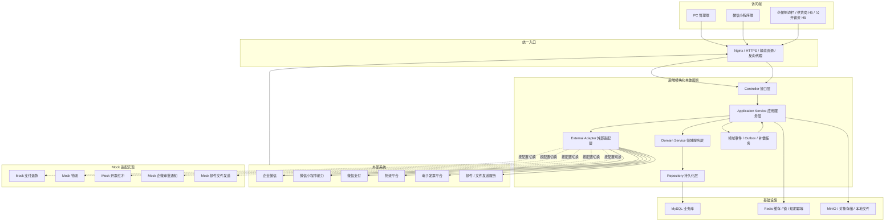
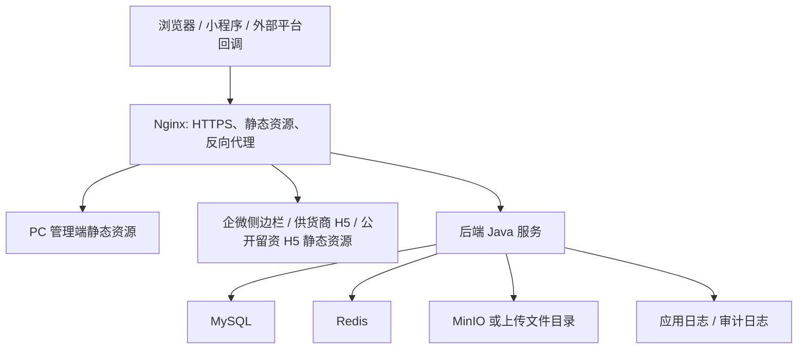

# 13-技术选型与总体架构设计

## 1. 文档定位

| 项目 | 说明 |
|---|---|
| 文档目标 | 在前序需求、流程、模块、领域模型、数据库、接口、外部联调、关键规则和异常补偿文档基础上，给出新系统的技术选型建议与总体架构设计 |
| 上游依据 | `00-文档说明.md`、`01-需求规格说明书.md`、`02-业务流程与状态机说明.md`、`03-模块设计文档.md`、`04-领域模型与数据字典.md`、`05-数据库设计文档.md`、`06-API接口文档.md`、`07-外部系统联调文档.md`、`11-关键业务规则与算法设计.md`、`12-异常处理与幂等补偿设计.md` |
| 设计边界 | 本文只面向新系统设计，不继承历史失败产物中的代码、数据库、接口、配置、架构和页面实现 |
| 选型口径 | 当前未发现前序文档已固定具体技术栈，因此本文所有技术栈均为“建议方案”，后续实现时可按团队能力和部署条件调整 |
| 核心原则 | 订单中心化、四类订单状态拆分、外部适配隔离、Mock 不分叉、回调幂等、异常可补偿、操作可审计 |

## 2. 架构目标与约束

### 2.1 架构目标

| 目标 | 设计说明 | 验收关注点 |
|---|---|---|
| 支撑三端协同 | 同一后端服务同时支撑 PC 管理端、小程序端、企微侧边栏、供货商 H5 和公开留资 H5 | 三端入口可按角色、身份和业务对象访问对应能力 |
| 保持订单中心化 | 后端以订单为单据链中心，串联支付、权益、发货、退款、发票、对账和代账材料 | 订单详情可追溯完整单据链 |
| 保持状态拆分 | 订单只保存支付、履约、退款、开票四类摘要状态，不设计单一 `order_status` | 页面、接口、数据库和测试均复用四类状态 |
| 降低毕设交付复杂度 | P0 阶段优先采用模块化单体，避免过早拆分微服务 | 本地、测试、演示环境可稳定部署和调试 |
| 隔离外部平台差异 | 企业微信、微信支付、物流、电子发票、邮件/文件发送均通过外部适配层接入 | 业务模块不直接依赖平台 SDK、Mock 类或平台特有字段 |
| 支持 Mock 与真实切换 | Mock、沙箱、真实平台共用内部适配契约、回调链路、状态枚举和幂等规则 | 切换接入模式不重写核心业务流程 |
| 强化异常补偿 | 支付、退款、物流、开票、红冲、审批、通知、对账均保留异常记录、重试和人工处理入口 | 外部成功内部失败、重复回调、乱序回调可追溯可处理 |
| 保证审计可追溯 | 敏感操作、外部回调、人工补偿、导入导出均写操作日志或回调事件 | 关键操作不可编辑、不可删除，可按订单和业务单号追踪 |

### 2.2 关键约束

| 约束 | 架构影响 |
|---|---|
| 不继承旧系统 | 不读取旧库表作为模型事实，不沿用旧接口路径，不复用旧架构分层；所有实现以新系统文档为准 |
| 不跨系统原子回滚 | 支付、退款、运单、发票等外部结果已产生后，内部通过异常待处理和人工补偿保持最终一致 |
| Mock 不分叉 | Mock 不新增专属状态、专属字段、临时表或快捷改库路径，必须走统一回调和业务服务 |
| 交易单据不物理删除 | 订单、支付、退款、发货、发票、对账、代账材料、审计日志默认不删除，错误通过状态、冲正、红冲、关闭原因或补偿处理表达 |
| 金额统一按分 | 后端、数据库和接口统一使用 `_cent` 金额字段，避免浮点误差 |
| 快照不可变 | 课程、规格、价格、税务、收货地址、发票抬头等下单或申请时生成快照，后续主数据修改不得污染历史单据 |
| 权限后端兜底 | 前端菜单和按钮隐藏只做体验控制，后端必须校验登录态、角色、按钮权限、数据范围和字段脱敏 |
| 敏感配置不入文档 | 真实密钥、真实商户号、真实回调地址、真实 SMTP 配置等不得写入设计文档、前端代码和日志明文 |

## 3. 技术栈选型建议

### 3.1 总体建议

| 层面 | 建议方案 | 选择理由 | 替代方案 |
|---|---|---|---|
| 架构形态 | 模块化单体优先，按业务域拆包，保留领域事件和适配层边界 | 满足毕设演示和 P0 闭环，部署简单，事务边界清晰，后续可按模块拆服务 | 微服务架构；仅在团队有运维、链路追踪、服务治理能力后考虑 |
| 后端语言 | Java LTS 版本 + Spring Boot 3.x | 企业后台、微信/企微/支付适配、事务、权限和生态成熟 | Kotlin + Spring Boot；Node.js/NestJS |
| 后端框架 | Spring Boot、Spring Web、Spring Validation、Spring Security 或等价鉴权框架 | 适合 REST API、参数校验、统一异常、认证授权和拦截器 | Sa-Token、Apache Shiro、NestJS Guard |
| 数据访问 | MyBatis / MyBatis-Plus | 对订单、对账、报表类复杂查询控制力强，适合显式 SQL 和索引优化 | Spring Data JPA；jOOQ |
| 数据库 | MySQL 8.x | 适合交易单据、状态枚举、唯一键、事务、索引和 JSON 快照 | PostgreSQL；国产数据库需重新评估 JSON、事务和 SQL 兼容性 |
| 缓存 | Redis | 登录态、验证码/短期令牌、幂等短缓存、分布式锁、热点配置和轻量队列 | Caffeine 本地缓存；不建议仅靠本地缓存支撑多实例 |
| 文件存储 | MinIO 或 S3 兼容对象存储；演示环境可本地目录挂载 | 支撑发票文件、红字发票、退款凭证、代账材料、导出文件统一管理 | 云厂商 OSS/COS；纯本地文件系统 |
| 前端 PC | Vue 3 + TypeScript + Vite + Element Plus 或 Ant Design Vue | 后台管理页面、表格、表单、筛选、弹窗、权限菜单实现效率高 | React + Ant Design Pro |
| 小程序 | 微信小程序原生框架 + TypeScript；或 uni-app Vue3 | P0 优先贴近微信登录、手机号授权、支付和订阅消息能力 | Taro；uni-app 多端复用 |
| H5/企微页面 | Vue 3 + TypeScript + Vite，按独立入口构建企微侧边栏、供货商 H5、公开留资 H5 | 与 PC 技术栈接近，便于复用接口类型、工具函数和权限处理 | React + Vite；小型页面可用原生 HTML/CSS/TS |
| API 文档 | springdoc-openapi / OpenAPI 3 | 便于前后端联调、生成接口类型、保持接口契约一致 | Apifox、Swagger UI、Knife4j |
| 数据库迁移 | Flyway | 数据库结构可版本化，支持本地、测试、演示环境一致初始化 | Liquibase；手写 SQL 脚本 |
| 构建工具 | 后端 Maven 或 Gradle；前端 pnpm + Vite | Maven 适合 Java 项目标准化，pnpm 适合多前端包管理 | Gradle；npm/yarn |
| 部署方式 | 服务器 Docker Compose 默认部署；Nginx 统一入口；systemd 作为非容器化备选 | 适合测试、毕设演示和服务器交付复现，便于打包 MySQL、Redis、MinIO、后端和前端静态资源 | Kubernetes；云托管平台 |

### 3.2 后端技术栈建议

| 能力 | 建议组件 | 设计口径 |
|---|---|---|
| Web API | Spring MVC / Spring Web | 按 `/api/app`、`/api/admin`、`/api/wecom/sidebar`、`/api/supplier-h5`、`/api/collab`、`/api/callbacks` 分入口 |
| 参数校验 | Jakarta Validation | DTO 层校验必填、格式、金额、枚举；业务状态由 Application Service 和 Domain Service 校验 |
| 鉴权授权 | Spring Security + JWT / Session Token | PC 管理端、学员端、供货商 H5 使用不同登录态；后端统一做角色、按钮、数据范围校验 |
| 数据访问 | MyBatis / MyBatis-Plus | Repository 只负责持久化和查询，不承载状态机业务规则 |
| 事务 | Spring Transaction | 单个业务动作内部本地事务提交；外部调用和弱依赖通过事件、回调和补偿解耦 |
| 领域事件 | 事件表 / Outbox + 定时重试 | 支付成功、退款成功、开票完成等事件在事务内落库，事务后异步分发副作用 |
| 幂等控制 | 幂等拦截器 + 唯一键 + 业务状态校验 | 写接口使用 `Idempotency-Key`；回调用 `source_system + event_no` 和业务幂等键 |
| 定时任务 | Spring Scheduler / XXL-JOB 可选 | 支付超时关闭、回调补偿、通知重试、对账导入任务、异常扫描 |
| 文件处理 | 对象存储 SDK + `sys_file_asset` | 业务表只存文件引用；文件下载必须鉴权和脱敏 |
| 日志审计 | SLF4J + Logback + `audit_operation_log` | 应用日志用于排障，业务审计写数据库，不保存敏感明文 |
| API 文档 | OpenAPI 注解或接口契约生成 | 与 `06-API接口文档.md` 保持路径、字段、状态码和通用响应结构一致 |

### 3.3 前端技术栈建议

| 端侧 | 建议方案 | 技术边界 |
|---|---|---|
| PC 管理端 | Vue 3 + TypeScript + Vite + Element Plus / Ant Design Vue | 承载后台菜单、列表、详情、审批、退款、发货、开票、对账、配置和审计，不承载学员购买支付流程 |
| 小程序端 | 微信小程序原生 + TypeScript，或 uni-app Vue3 | 承载微信登录、手机号授权、课程浏览、下单支付、学习、退款、发票、地址和物流查询 |
| 企微侧边栏 | Vue 3 + TypeScript + Vite 单独构建 H5 | 依赖企微 JS-SDK 上下文，按外部联系人展示线索、学员和订单摘要 |
| 供货商 H5 | Vue 3 + TypeScript + Vite 单独构建 H5 | 只处理供货商自身采购单确认、拒绝、物流和进项发票回填，不进入 PC 权限体系 |
| 公开留资 H5 | Vue 3 / 静态轻量 H5 | 支持推广码、手机号留资、意向课程提交，匿名可访问 |
| 类型共享 | OpenAPI 生成 TypeScript 类型 | 前端不手写状态枚举；订单四类状态、退款状态、开票状态复用后端枚举编码 |

### 3.4 部署与运维技术建议

| 能力 | 建议方案 | 说明 |
|---|---|---|
| 反向代理 | Nginx | 统一 HTTPS、静态资源、API 代理、回调入口、上传大小限制和访问日志 |
| 后端运行 | Docker Compose 编排容器为默认；systemd Java 进程为备选 | 最终服务器部署优先 Docker Compose；已有基础设施或禁用容器环境时再使用 systemd |
| 数据库 | MySQL 独立服务 | 重要数据定期备份；演示环境可初始化种子数据 |
| Redis | 独立 Redis 服务 | 用于缓存、锁、短期幂等记录和轻量异步队列，不作为唯一业务事实来源 |
| 文件服务 | MinIO / 对象存储 / 本地挂载目录 | 发票、凭证、导出文件统一通过文件资产表管理 |
| 静态资源 | Nginx 托管 PC 与 H5 构建产物 | 小程序包通过微信平台上传发布，H5 和 PC 由 Nginx 服务 |
| 配置管理 | 环境变量 + 配置文件 + 数据库配置表 | 密钥类配置只放服务端环境或密钥管理系统，页面仅脱敏展示 |
| 备份 | 数据库备份 + 文件存储备份 | 订单、支付、退款、发票、审计和文件引用必须可恢复 |

## 4. 总体架构图说明

### 4.1 总体架构图

### 4.2 架构说明

| 架构对象 | 职责说明 |
|---|---|
| PC 管理端 | 面向内部角色，访问订单、课程、退款、发货、开票、对账、代账、配置和审计能力 |
| 小程序端 | 面向学员，访问课程浏览、订单支付、学习中心、退款、发票、地址和物流能力 |
| 企微/外部协同端 | 包括企微侧边栏、供货商 H5、公开留资 H5；每类入口有独立鉴权和数据范围 |
| Nginx | 统一 HTTPS、静态资源、API 反向代理、外部回调入口、上传大小限制和日志记录 |
| 后端服务 | 采用模块化单体，内部按用户权限、线索学员、课程学习、交易订单、支付退款、履约库存、采购供应、发票税务、对账代账、外部协同、通知审批、配置审计拆包 |
| MySQL | 保存业务事实、状态机、单据链、回调事件、审计日志和文件资产引用 |
| Redis | 保存登录态辅助信息、短期幂等记录、分布式锁、热点配置和轻量任务状态；不替代 MySQL 作为业务事实 |
| 文件存储 | 保存发票文件、红字发票、退款凭证、代账材料、导出文件和面单文件 |
| 外部系统 | 企业微信、微信小程序、微信支付、物流、电子发票、邮件/文件发送等真实平台 |
| Mock 适配层 | 在开发、测试、演示环境模拟外部系统返回和回调，但不绕过业务服务和状态机 |

## 5. 后端分层架构

### 5.1 分层职责

| 分层 | 职责 | 不允许事项 |
|---|---|---|
| Controller | 接收 HTTP 请求，完成鉴权上下文读取、参数校验、DTO 转换、统一响应和错误码返回 | 不写业务状态机，不直接访问数据库，不直接调用外部平台 |
| Application Service | 编排一个用例的完整流程，控制事务边界，调用领域服务、仓储、外部适配和事件发布 | 不把平台 SDK 细节写入应用服务，不绕过领域规则直接改状态 |
| Domain Service | 承载跨实体业务规则、状态流转、金额计算、税额计算、权益规则、退款副作用规则 | 不处理 HTTP、Token、平台签名和数据库 SQL 细节 |
| Repository | 持久化聚合、查询业务对象、保存状态、写单据链、写审计和回调事件 | 不承载业务决策，不调用外部接口 |
| External Adapter | 封装企业微信、微信支付、物流、电子发票、邮件/文件发送和 Mock 实现 | 不直接修改订单、退款、发货、发票等核心业务状态 |
| Event / Compensation | 处理领域事件、Outbox 分发、重试、异常待处理和人工补偿动作 | 不绕过业务模块状态机，不直接改库制造终态 |

### 5.2 后端包结构建议

| 包或模块 | 说明 |
|---|---|
| `interfaces` | Controller、请求响应 DTO、接口鉴权注解、统一异常返回 |
| `application` | 应用服务、用例编排、事务边界、事件发布、补偿入口 |
| `domain` | 领域对象、领域服务、状态机、业务规则、领域事件定义 |
| `infrastructure.persistence` | Repository 实现、Mapper、数据库查询、事务内落库 |
| `infrastructure.integration` | 外部适配接口和真实平台、Mock、沙箱实现 |
| `infrastructure.security` | 登录态、JWT、权限校验、数据范围、字段脱敏 |
| `infrastructure.file` | 文件资产、对象存储、下载鉴权、文件摘要 |
| `infrastructure.job` | 定时任务、Outbox 重试、异常扫描、支付超时关闭 |
| `shared` | 通用枚举、错误码、金额工具、幂等工具、TraceId、审计上下文 |

### 5.3 应用服务示例

| 用例 | Application Service 编排 | 事务建议 |
|---|---|---|
| 创建订单 | 校验学员手机号、课程规格、价格、地址、库存提示；生成订单、订单明细、商户订单号和快照 | 单个本地事务；不调用支付平台 |
| 拉起支付 | 校验订单待支付且未超时；调用支付适配器获取支付参数；记录适配请求摘要 | 外部调用不与订单创建混在同一事务；失败不关闭订单 |
| 支付回调 | 验签后写回调事件；校验金额和幂等；更新订单支付状态、写支付记录、发布支付成功事件 | 主状态和支付记录同一事务；权益、发货、通知可由事件补偿 |
| 退款审核 | 校验权限、订单状态、可退金额；通过后调用退款适配器或转人工；更新退款单状态 | 审核状态变更本地事务；外部退款结果由回调推进终态 |
| 发货确认 | 校验订单已支付、待发货、库存、地址；调用物流适配器；保存运单、扣库存、更新履约状态 | 外部运单已产生但内部失败进入异常待处理 |
| 开票处理 | 校验订单已支付、金额、抬头、税务快照；自动或人工开票；保存发票文件和状态 | 自动结果通过回调或受理结果推进；失败转待开具 |
| 对账导入 | 校验文件摘要和月份；解析账单；按商户订单号匹配支付、退款和订单；生成差异 | 文件存储和批次落库成功后再生成明细；失败不留半成品结果 |

## 6. 前端架构

### 6.1 PC 管理端

| 设计项 | 建议方案 |
|---|---|
| 应用定位 | 后台运营管理端，面向超管、教务、讲师、运营、仓管、客服、代账等内部角色 |
| 路由结构 | 按一级菜单和二级菜单组织：首页、客户与学员、课程与履约、供应与库存、交易售后、财税与报表、系统配置 |
| 权限控制 | 登录后调用 `/api/admin/auth/me` 获取菜单、按钮、数据范围和字段脱敏规则；前端隐藏无权限入口，后端兜底鉴权 |
| 状态展示 | 订单列表和详情必须分别展示 `payment_status`、`fulfillment_status`、`refund_status`、`invoice_status` |
| 数据表格 | 统一封装筛选、分页、排序、导出、字段脱敏和空状态 |
| 表单动作 | 退款审核、发货、开票、红冲、采购、角色审批等写操作必须传 `Idempotency-Key` 或由后端业务键兜底 |
| 异常入口 | PC 端应提供异常待处理聚合入口，按支付、退款、发货、开票、采购、对账、通知审批分类处理 |
| 不承载范围 | 不承载学员购买支付流程，不替代小程序学习中心，不把企微侧边栏和供货商 H5 做成 PC 一级菜单 |

### 6.2 小程序端

| 设计项 | 建议方案 |
|---|---|
| 应用定位 | 学员侧交易和学习入口 |
| 登录边界 | 首次微信登录可匿名浏览；交易前必须完成手机号授权 |
| 页面范围 | 课程列表、课程详情、订单确认、支付成功、学习中心、订单列表、订单详情、退款、发票、地址、物流、通知 |
| 支付边界 | 小程序只拉起支付，不自行确认支付成功；最终支付状态以后端支付回调或查询结果为准 |
| 退款边界 | 学员提交退款申请和查看进度，不能直接改变退款终态 |
| 发票边界 | 学员维护抬头和申请开票，发票金额只读且等于订单实付金额 |
| 通知边界 | 站内通知为系统内必达，微信订阅消息只作为补充 |
| 状态口径 | 订单详情按四类状态和子单据状态展示可操作按钮，不在前端硬编码状态流转 |

### 6.3 H5/企微页面

| 页面 | 技术边界 | 鉴权边界 |
|---|---|---|
| 企微侧边栏 | 识别外部联系人，展示线索、学员、订单摘要，支持建档、写跟进、匹配学员 | 企业微信 JS-SDK 上下文签名 + 内部登录态 + 运营数据范围 |
| 供货商 H5 | 采购单列表、详情、确认、拒绝、填写物流、回填进项发票 | 供货商访问令牌；只允许访问自身 `supplier_id` 采购单 |
| 公开留资 H5 | 用户匿名提交姓名、手机号、意向课程和来源码 | 无需登录；需要频率限制、手机号格式校验和来源码记录 |
| 企微通知卡片落地页 | 从企微卡片跳转到 PC 待办或详情页 | 必须重新校验内部登录态、角色和数据范围 |

## 7. 外部系统适配层设计

### 7.1 适配层总体原则

| 原则 | 说明 |
|---|---|
| 业务依赖内部接口 | 支付退款、履约库存、发票税务、通知审批等模块只依赖内部适配接口 |
| 适配实现可替换 | 同一接口可有 Mock、沙箱、真实三类实现，通过配置切换 |
| 回调先落库 | 外部回调先写 `integration_callback_event`，再由业务模块做幂等处理 |
| 平台字段标准化 | 平台返回字段转换为系统内部标准字段，业务模块不直接使用平台原始字段 |
| 失败原因可追溯 | 适配层返回标准错误码、失败原因、外部事件号和摘要，不抛出不可读平台异常 |
| 敏感信息脱敏 | 密钥、签名、手机号、税号、邮箱、地址、完整回调原文不得明文写日志 |

### 7.2 外部能力适配设计

| 外部能力 | 内部适配接口建议 | 主要调用方 | 回调或异步事件 | 异常补偿 |
|---|---|---|---|---|
| 微信小程序 | `WechatMiniProgramAdapter`：登录、手机号解析、订阅消息授权状态 | 用户与权限、通知审批 | 无强制业务回调；订阅消息发送结果可记录通知状态 | 手机号冲突进入学员合并；订阅失败由站内通知兜底 |
| 企业微信 | `WecomAdapter`：扫码登录、工作台身份、侧边栏上下文、审批、卡片通知 | 用户与权限、线索学员、通知审批、采购供应 | 审批回调、卡片回执 | 审批回写失败重试；卡片失败 PC 待办兜底 |
| 微信支付 | `PaymentAdapter`：创建支付参数、支付查询、退款申请、退款查询 | 支付退款 | 支付回调、退款回调 | 金额不一致、超时、重复、乱序、已关闭后成功进入支付或退款异常待处理 |
| 物流平台 | `LogisticsAdapter`：创建运单、获取面单、订阅轨迹、查询轨迹、云打印可选 | 履约库存 | 物流轨迹回调、签收回调 | 外部已出单内部失败补录运单；库存流水缺失补偿 |
| 电子发票 | `InvoiceAdapter`：开票、查询开票、红冲、查询红冲 | 发票税务 | 开票回调、红冲回调 | 自动失败转待开具；红冲失败保留已开具并支持重试或人工上传 |
| 邮件/文件发送 | `MessageFileAdapter`：邮件发送、下载链接发送、文件发送记录 | 发票税务、对账代账、通知审批 | 邮件受理或失败结果 | 邮件失败不回滚开票；支持修正邮箱、重新上传、重新发送 |
| Mock 外部能力 | 各适配接口的 Mock 实现 | 所有依赖外部能力的业务模块 | 模拟真实回调事件 | 用正式异常待处理和人工补偿入口处理 |

## 8. Mock 与真实接入切换架构

### 8.1 切换模式

| 模式 | 使用场景 | 配置建议 | 行为要求 |
|---|---|---|---|
| `mock` | 本地开发、测试、毕设演示、异常场景验证 | 默认开发环境启用，可在系统配置或环境变量中选择 Mock 场景 | 生成标准适配结果和 Mock 回调事件，投递到与真实平台共用的 `/api/callbacks/**` 路径，不直接改业务状态 |
| `sandbox` | 外部平台沙箱联调 | 使用沙箱凭证、沙箱回调和沙箱账号 | 仍走统一适配接口和统一回调事件表 |
| `real` | 真实平台上线接入 | 使用真实凭证和真实回调入口 | 必须开启签名校验、回调幂等、敏感日志脱敏和异常补偿 |

### 8.2 切换设计

| 设计项 | 建议 |
|---|---|
| 配置来源 | 环境变量确定默认模式，数据库系统配置可脱敏展示当前模式；敏感凭证只在服务端配置 |
| Bean 选择 | 后端根据 `integration.mode` 或按能力维度选择 `mock/sandbox/real` 适配实现 |
| 能力维度 | 支付、退款、物流、开票、红冲、企微审批、企微卡片、邮件可分别配置模式 |
| 回调入口 | Mock 和真实都走 `/api/callbacks/**`，Mock 可由内部任务或测试入口生成回调请求 |
| 幂等键 | Mock 使用与真实平台相同的业务幂等键和事件号规则 |
| 场景控制 | Mock 场景只控制外部返回结果，如成功、失败、超时、重复回调、乱序回调、金额不一致 |
| 测试复用 | 同一套核心验收用例应能在 Mock 和沙箱环境复用，差异只来自平台配置和外部返回摘要 |

### 8.3 不允许的 Mock 实现

| 不允许事项 | 原因 |
|---|---|
| Mock 直接更新订单为已支付 | 会绕过支付回调幂等、支付记录、权益、发货任务和审计链路 |
| Mock 新增演示专用状态 | 会破坏正式状态机和前端验收口径 |
| Mock 使用临时表替代正式单据 | 会导致真实切换时重写业务流程 |
| Mock 跳过签名、事件号和幂等字段设计 | 无法验证重复回调、乱序回调和异常补偿 |
| Mock 把外部成功内部失败静默吞掉 | 无法演示和验证关键异常补偿能力 |

## 9. 数据一致性、幂等、事务边界与异常补偿总体策略

### 9.1 数据一致性策略

| 场景 | 一致性策略 | 说明 |
|---|---|---|
| 单库内主状态更新 | 本地事务强一致 | 订单支付状态、支付记录、回调事件处理结果等可在同一事务内提交 |
| 主状态与弱依赖 | 最终一致 | 通知、企微卡片、邮件、线索转化、对账基础数据等失败不回滚主状态 |
| 外部平台结果 | 最终一致 + 人工补偿 | 外部已支付、已退款、已出单、已开票后，内部失败进入异常待处理 |
| 单据链索引 | 可重建最终一致 | `order_document_link` 写入失败不回滚子单据，可通过补偿任务重建 |
| 文件与业务单据 | 业务状态优先，文件补偿 | 开票成功但文件保存失败时，发票状态按平台结果处理，文件进入补偿 |
| 对账结果 | 不反向改交易状态 | 对账差异只生成核对记录、待办和备注，不直接改支付或退款终态 |

### 9.2 幂等策略

| 幂等层 | 适用范围 | 落点 |
|---|---|---|
| 请求幂等 | 创建订单、退款申请、发货、开票、采购确认、材料上传 | `Idempotency-Key` + 业务键；重复返回首次结果 |
| 业务唯一键 | 订单号、商户订单号、退款单号、发货单号、发票申请号、采购单号 | 数据库唯一键兜底 |
| 外部流水幂等 | 支付、退款、物流、发票、红冲 | 外部流水号和业务单号组合唯一 |
| 回调事件幂等 | 支付回调、退款回调、物流回调、开票回调、红冲回调、企微审批回调 | `integration_callback_event.source_system + event_no` |
| 通知幂等 | 站内通知、订阅消息、企微卡片 | `idempotency_key + channel + receiver_user_id` |
| 文件幂等 | 对账导入、发票文件、凭证、代账材料 | `file_digest + biz_type + biz_id` 或 `bill_month + bill_source + file_digest` |

### 9.3 事务边界建议

| 用例 | 事务边界 | 外部调用处理 |
|---|---|---|
| 订单创建 | 订单主单、明细、价格快照、税务快照同一事务 | 不调用支付平台 |
| 支付回调 | 回调事件、支付记录、订单支付状态同一事务 | 支付成功后置动作通过事件分发，可重试 |
| 支付成功副作用 | 每类副作用独立事务，如权益、发货任务、通知、线索转化 | 单个副作用失败不回滚支付成功 |
| 退款审核 | 退款单审核状态变更本地事务 | 原路退款调用结果未知时保持处理中并查询补偿 |
| 退款成功 | 退款状态和退款成功事件同一事务 | 权益、提醒、红冲、对账副作用独立补偿 |
| 发货确认 | 内部保存发货、库存流水、订单履约摘要尽量同一事务 | 外部运单已产生但内部失败进入异常补偿 |
| 开票回调 | 发票状态、发票文件引用、订单开票摘要同一事务 | 通知、邮件发送独立补偿 |
| 对账导入 | 批次、明细、差异结果按批次事务或分批事务 | 导入失败不得留下不可识别半成品 |

### 9.4 异常补偿总体策略

| 异常来源 | 聚合依据 | 处理入口 |
|---|---|---|
| 支付异常 | 回调事件失败、金额不一致、已关闭后成功、支付记录缺失 | 支付异常待处理，支持查询补偿、补写支付记录、人工核对 |
| 退款异常 | 退款失败、待人工退款、退款成功副作用失败 | 退款处理和异常待处理，支持重试、转人工、上传凭证 |
| 发货异常 | 运单已产生内部失败、面单失败、库存扣减失败、签收未同步 | 发货异常待处理，支持补录运单、库存校正、人工签收 |
| 开票红冲异常 | 自动开票失败、文件缺失、红冲失败、发票号冲突 | 开票管理和红冲待办，支持人工开票、重试红冲、上传凭证 |
| 采购异常 | 审批回写失败、供货商推送失败、收货数量不一致、进项票缺失 | 采购异常和代账风险提醒 |
| 对账异常 | 金额差异、手续费差异、未匹配、重复记录、导入失败 | 收款对账中心，支持备注、核对、导出差异 |
| 通知审批异常 | 站内通知失败、企微卡片失败、审批回调失败 | 通知审批模块，支持重试、PC 待办兜底、人工关闭 |

## 10. 部署架构

### 10.1 单机演示部署建议

### 10.2 部署组件说明

| 组件 | 建议部署 | 说明 |
|---|---|---|
| 服务器 | 一台 Linux 云服务器或本地演示服务器 | P0 和毕设演示阶段可单机部署；需保证磁盘空间和备份 |
| Nginx | 80/443 入口，强制 HTTPS | 托管 PC/H5 静态资源，代理后端 `/api/**` 和 `/api/callbacks/**` |
| 后端服务 | Docker 容器或 Java 进程 | 暴露内网端口给 Nginx，不直接暴露数据库和 Redis |
| PC 静态资源 | Nginx 静态目录 | 构建产物按版本发布，支持刷新回退 |
| H5 静态资源 | Nginx 静态目录 | 企微侧边栏、供货商 H5、公开留资 H5 可按独立路径部署 |
| 小程序 | 微信公众平台上传发布 | 小程序请求后端 HTTPS API，不由服务器托管小程序包 |
| MySQL | 独立容器或服务 | 保存业务主数据、回调事件、审计日志、配置和文件资产引用 |
| Redis | 独立容器或服务 | 缓存、锁、短期幂等和任务状态 |
| 上传文件 | MinIO、对象存储或挂载目录 | 发票、凭证、面单、对账文件、代账材料和导出文件 |
| 回调入口 | `/api/callbacks/**` | 由 Nginx 暴露公网 HTTPS，后端校验签名、时间戳和事件号 |
| 日志与备份 | 应用日志文件 + 数据库审计表 + 定期备份 | 应用日志用于排障，审计日志用于业务追溯 |

### 10.3 路由建议

| 路径 | 指向 | 说明 |
|---|---|---|
| `/admin/` | PC 管理端静态资源 | 企业微信工作台可跳转该路径 |
| `/h5/wecom-sidebar/` | 企微侧边栏 H5 | 需要企微 JS-SDK 上下文 |
| `/h5/supplier/` | 供货商 H5 | 通过供货商访问令牌进入 |
| `/h5/lead/` | 公开留资 H5 | 匿名访问，需频率限制 |
| `/api/app/**` | 小程序端 API | 学员登录态 |
| `/api/admin/**` | PC 管理端 API | 内部人员登录态和角色权限 |
| `/api/wecom/sidebar/**` | 企微侧边栏 API | 企微上下文签名和内部登录态 |
| `/api/supplier-h5/**` | 供货商 H5 API | 供货商访问令牌 |
| `/api/collab/**` | 审批、通知、待办、异常补偿 API | 内部人员或系统服务调用 |
| `/api/callbacks/**` | 外部回调 API | 平台签名、事件号和幂等处理 |

## 11. 技术选型风险与替代方案

| 风险 | 影响 | 缓解方案 | 替代方案 |
|---|---|---|---|
| 模块化单体后期变大 | 单个服务代码量上升，模块边界可能模糊 | 按业务域强制分包，跨模块通过应用服务和领域事件协作，避免直接互改表 | 后期按支付退款、履约库存、发票税务、对账代账拆服务 |
| MySQL JSON 快照滥用 | 查询困难、字段不可控 | 快照只保存历史追溯必要字段，高频筛选字段单独列化 | PostgreSQL JSONB；拆分更多快照明细表 |
| Redis 被误用为事实来源 | Redis 丢失导致状态不一致 | 业务事实全部落 MySQL，Redis 只做缓存、锁和短期幂等 | 本地缓存 + 数据库唯一键兜底 |
| 外部平台接入复杂 | 支付、企微、物流、发票联调周期不可控 | 先定义统一适配契约和 Mock，真实接入只替换适配实现 | P0 保持 Mock + 人工处理，P1 接沙箱，P2 接真实 |
| Mock 与真实行为不一致 | 演示通过但真实接入失败 | Mock 必须走回调链路、幂等键和正式状态机；验收用例复用 | 建立沙箱联调用例集 |
| 前端状态硬编码 | 后续状态扩展导致页面错误 | 枚举由后端接口或 OpenAPI 类型统一导出，前端只做展示映射和按钮可见性判断 | 配置化状态文案和按钮规则 |
| 文件存储迁移 | 本地文件切云存储时引用失效 | 业务表只存文件编号或 storage key，不写死物理路径 | MinIO 先行，后续迁移 OSS/COS |
| 定时任务单实例限制 | 多实例部署后重复执行 | 任务加分布式锁和幂等键，补偿逻辑可重复执行 | XXL-JOB、Quartz 集群模式 |
| Spring Security 学习成本 | 权限配置实现复杂 | 先实现最小 RBAC、菜单按钮、数据范围和字段脱敏，逐步补强 | Sa-Token 等轻量鉴权框架 |
| 过早引入微服务 | 部署、事务、联调和运维成本过高 | P0 采用模块化单体，事件和适配接口预留拆分边界 | 有真实并发和团队运维能力后再拆分 |

## 12. 前序文档修订建议

暂无。
